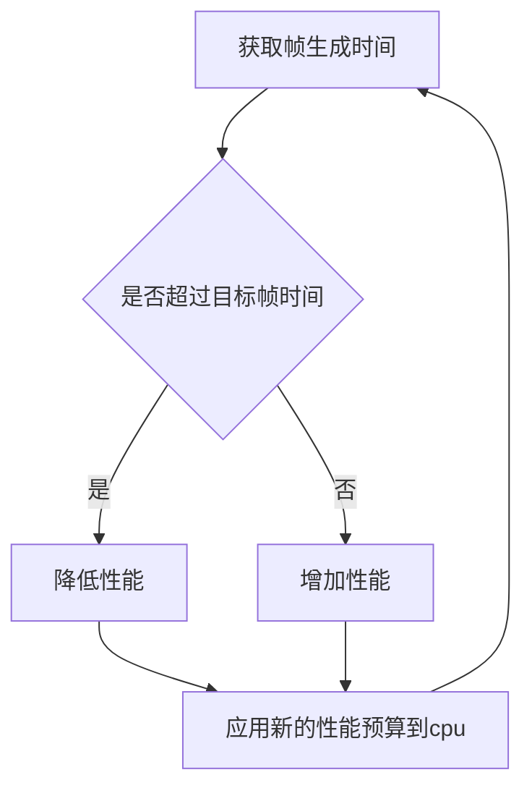
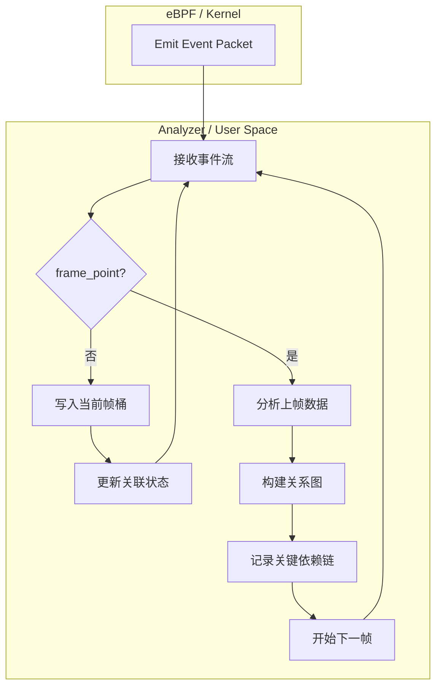
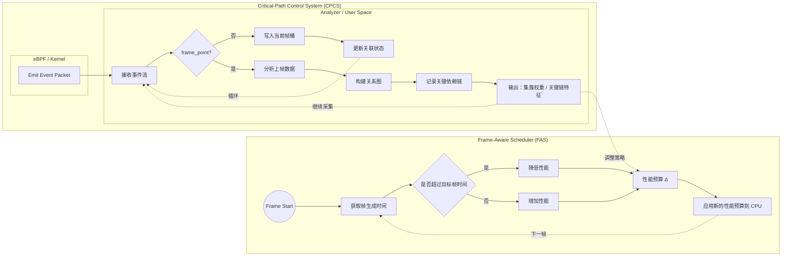

本文首次提出并定义 CPCS（Critical-Path Control System），一种以帧关键路径为核心信号，用于指导性能预算在多集簇系统中分配的控制系统思想。

<!--more-->

## 介绍

CPCS（Critical-Path Control System）是本文提出的一种系统设计思想，用于补充现有 FAS（Frame Aware Scheduling）在多集簇性能分配上的信息盲区。

本文仅记录 CPCS 的研究动机与可行性验证，不包含完整的算法或代码实现。

## FAS闭环控制

在将CPCS应用到FAS之前，先回顾一下FAS的概念。

FAS即帧感知调度。需要注意的是这里**调度**是泛化的指资源的分配，而不是**EEDVF调度器**里决定线程何时使用，使用多久cpu资源的**调度器**。因为FAS一般被实现为控制cpu频率，因此它的概念其实更接近**调速器**。当然也可以存在用于其它调度目标的FAS，本文专指根据帧信息调控cpu性能的FAS。

FAS闭环控制cpu频率的原理是：当帧生成时间超过目标时，说明cpu性能有空余，降低性能预算减少电压，进而降低开销。反之，当帧生成时间小于目标时，说明cpu性能不足，提高性能预算以给到更多的性能。

FAS能得到的只有一个抽象的性能预算，而不是直接的cpu目标频率。因此需要一个映射将它转化为cpu频率，并据此控制和集簇的实际频率。

这导致一个问题：瓶颈集簇以外的cpu集簇被不必要的拉高频率。

因为FAS只能得知总体的帧时间超时，而无法得知具体的cpu核心的性能不足。

## POC

首先需要验证可行性。

没有人可以未卜先知，因此无法在本帧执行之前就得知本帧的关键线程路径是什么。所以，CPCS有效的前提是游戏帧的行为**高度重复**。如果这点成立，就可以用之前帧的关键路径预测本帧的关键路径。这构成了 CPCS 可行性的必要条件，也是本段试图验证的核心假设。

根据我之前（[shadow3aaa/frame-analyzer-ebpf](https://github.com/shadow3aaa/frame-analyzer-ebpf)）的经历，ebpf的编写和使用堪称折磨，即使是使用了aya-rs这种高度简化构建流程的框架。所幸我可以让codex帮我完成poc程序的编写，只需要抄frame-analyzer的代码即可。

CPCS-POC的结构如下。

测试游戏场景得到如下的dag图。每个红色箭头都是每帧的关键路径。

推理关键路径的方法这里不详细描述。

可以看到图中那条尤其鲜艳的红色。那是无数帧的关键路径叠加在一起导致的。从线程(tid3575)开始的关键路径是相对集中的。因此确实有可行性。

## CPCS权重分配

由于木桶效应，关键路径上的线程就是对帧生成时间真正有决定性影响的线程。

CPCS可以分析关键路径，所以它可以解决FAS看不到具体是哪些线程对帧生成时间影响最大的问题。

因为只有关键路径对帧生成时间有决定性影响。显然必须使用关键路径的信息来推理权重，而完全不考虑关键路径以外的信息。

而关键路径上的信息有：线程执行时间（节点）、线程同步等待时间（边）、调度时间。

futex 等待时间和调度等待时间参与决定关键路径，但它们本身并不随 cpu 性能线性变化，因此不适合作为性能预算分配的权重。**寻找关键路径时应该考虑三者**，但**计算权重时应该仅考虑执行时间**。

在此基础上，引入以下两个经验性假设：

- 计算量固定假设：关键路径上的线程不是贪婪地抢占cpu时间，只是需要固定的计算量
- 边际收益最大化假设：在计算量固定假设的前提下，执行时间与 cpu 频率近似成反比。因此，执行时间越长的节点，其所在集簇的频率提升所能带来的帧长度收益越大。

因此，将关键路径上各线程在其所属 cpu 集簇上的执行时间作为权重，将 FAS 闭环控制得到的总性能预算分配到各个集簇是一个很合理的方向。

## 工程实践

基于以上实验和思想，我将CPCS探索性集成到我个人的FAS实现[fas-rs](https://github.com/shadow3aaa/fas-rs)未公开的分支中。目前仍在探索具体参数，这里暂不展示具体的表现和代码实现，大体的架构如下。

## 局限

需要指出的是，CPCS 并非适用于所有类型的负载。其有效性依赖于帧生成过程具备一定的统计稳定性，且帧由可预测性较强的关键路径所主导。对于非游戏应用这点极为明显，其关键路径非常散乱。
