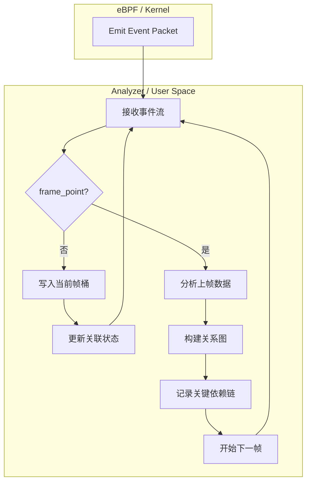
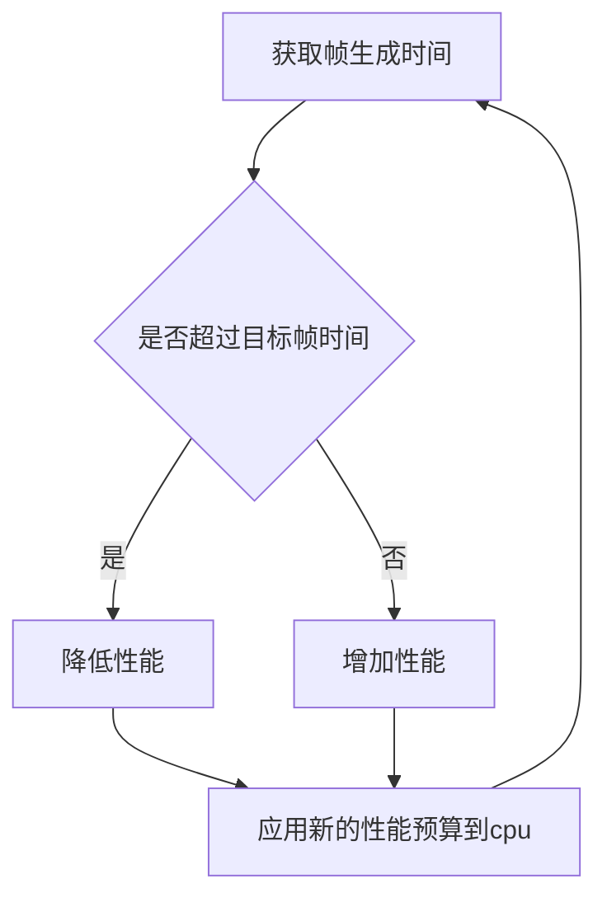

本文记录CPCS的研究

<!--more-->

## 介绍

CPCS，即Critical-Path Control System，是FAS(Frame Aware Scheduling)的补充。其目的在于分析关键线程路径，以更合理的分配FAS当前分配的总性能到各集簇。

## POC

首先需要验证可行性。

没有人可以未卜先知，因此无法在本帧执行之前就得知本帧的关键线程路径是什么。所以，CPCS有效的前提是游戏帧的行为**高度重复。**如果这点成立，就可以用之前帧的关键路径预测本帧的关键路径。这就是本次POC要验证的目标。

根据我之前（[shadow3aaa/frame-analyzer-ebpf](https://github.com/shadow3aaa/frame-analyzer-ebpf)）的经历，ebpf的编写和使用堪称折磨，即使是使用了aya-rs这种高度简化构建流程的框架。所幸我可以让codex帮我完成poc程序的编写，只需要抄frame-analyzer的代码即可。

CPCS-POC的结构如下。

测试了游戏场景，得到下面这个dag图。红色即关键路径。

推理关键路径的方法不详细描述，简单来说是用最后负责提交buffer的线程开始向前推最长链。

可以看到图中那条尤其鲜艳的红色。那是无数帧的关键路径叠加在一起导致的。从线程(tid3575)开始的关键路径是相对集中的。因此确实有可行性。

## FAS闭环控制

在将CPCS应用到FAS之前，先回顾一下FAS的概念。

FAS即帧感知调度。需要注意的是这里**调度**是泛化的指资源的分配，而不是**EEDVF调度器**里决定线程何时使用，使用多久cpu资源的**调度器**。因为FAS一般被实现为控制cpu频率，因此它的概念其实更接近**调速器**。当然也可以存在用于其它调度目标的FAS，本文专指根据帧信息调控cpu性能的FAS。

FAS闭环控制cpu频率的原理是这样：当帧生成时间超过目标时，说明cpu性能有空余，降低性能预算减少电压，进而降低开销。反之，当帧生成时间小于目标时，说明cpu性能不足，提高性能预算以给到更多的性能。

FAS能得到的只有一个抽象的性能预算，而不是直接的cpu目标频率。因此需要一个映射将它转化为cpu频率，并据此控制和集簇的实际频率。

这导致一个问题：瓶颈集簇以外的cpu集簇被不必要的拉高频率。

因为FAS只能得知总体的帧时间超时，而无法得知是哪个cpu核心的性能不足。

## CPCS权重分配

根据木桶效应，关键路径上的线程就是对帧生成时间真正有决定性影响的线程。

CPCS可以分析关键路径，所以它可以解决FAS看不到具体是哪些线程对帧生成时间影响最大的问题。
