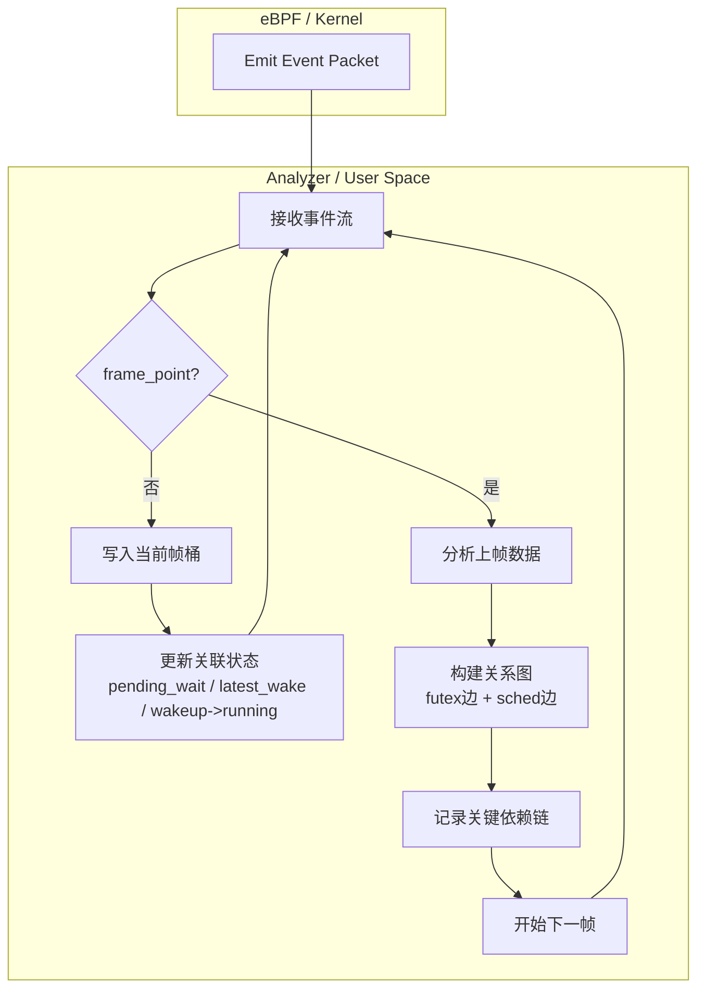

本文记录CPCS的研究

<!--more-->

## 介绍

CPCS，即Critical-Path Control System，是FAS(Frame Aware Scheduling)的补充。其目的在于分析关键线程路径，以更合理的分配FAS当前分配的总性能到各集簇。

## POC

首先需要验证可行性。

没有人可以未卜先知，因此无法在本帧执行之前就得知本帧的关键线程路径是什么。所以，CPCS有效的前提是游戏帧的行为**高度重复。**如果这点成立，就可以用之前帧的关键路径预测本帧的关键路径。这就是本次POC要验证的目标。

根据我之前（[shadow3aaa/frame-analyzer-ebpf](https://github.com/shadow3aaa/frame-analyzer-ebpf)）的经历，ebpf的编写和使用堪称折磨，即使是使用了aya-rs这种高度简化构建流程的框架。所幸我可以让codex帮我完成poc程序的编写，只需要抄frame-analyzer的代码即可。

POC的结构如下。

测试了游戏场景，得到下面这个dag图。红色即关键路径。

可以看到从线程(tid3575)开始的红色路径是相对集中的。因此确实有可行性。
