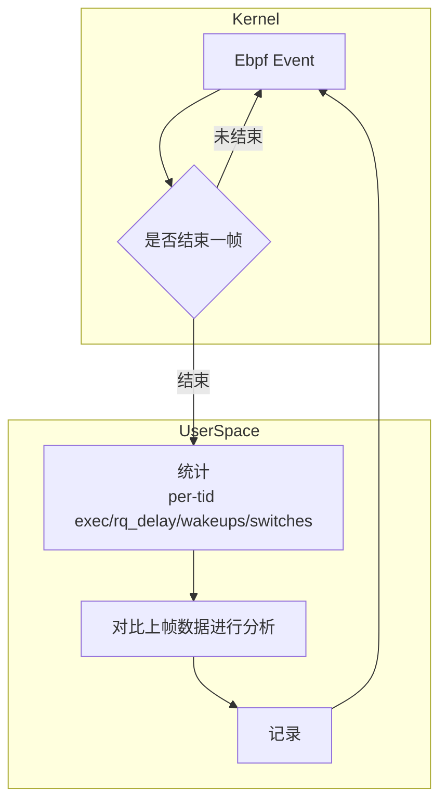
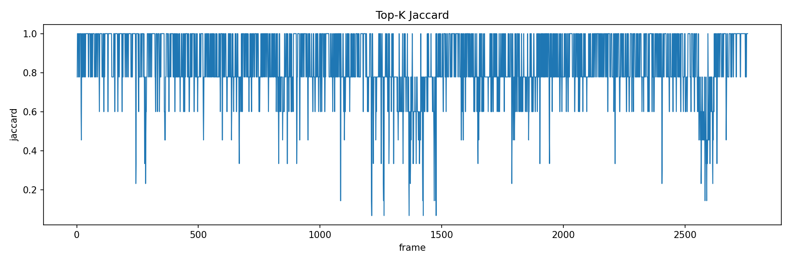
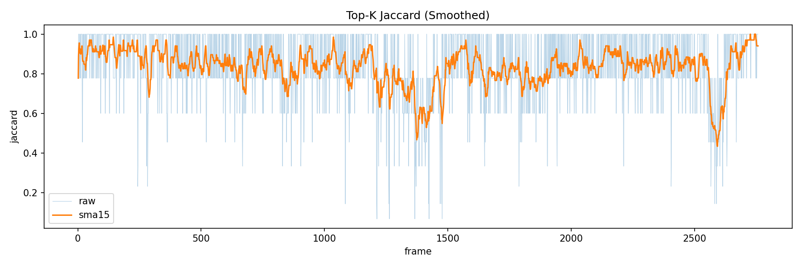

本文记录CPCS的研究

<!--more-->

## 介绍

CPCS，即Critical-Path Control System，是FAS(Frame Aware Scheduling)的补充。其目的在于分析关键线程路径，以更合理的分配FAS当前分配的总性能到各集簇。

## POC

首先需要验证可行性。

没有人可以未卜先知，因此无法在本帧执行之前就得知本帧的关键线程路径是什么。所以，CPCS有效的前提是游戏帧的行为**高度重复。**如果这点成立，就可以用之前帧的关键路径预测本帧的关键路径。这就是本次POC要验证的目标。

根据我之前（[shadow3aaa/frame-analyzer-ebpf](https://github.com/shadow3aaa/frame-analyzer-ebpf)）的经历，ebpf的编写和使用堪称折磨，即使是使用了aya-rs这种高度简化构建流程的框架。所幸我可以让codex帮我完成poc程序的编写，只需要抄frame-analyzer的代码即可。

POC的结构如下。

测试了一些游戏，将对比两帧的top-k（score = exec_ns + rq_delay_ns）线程集合的数据整理为csv，得到下面这个不错的图表。

下面是平滑后的结果

除了曲线图以外，其它一些统计数据如下

- count: 2756
- mean: 0.83295
- p25: 0.77778
- p75: 1.0
- p90: 1.0
- min: 0.06667
- max: 1.0

可以看到Jaccard ≈ 0.78–1.00，POC-0要验证的目标基本成立。

## POC-1
