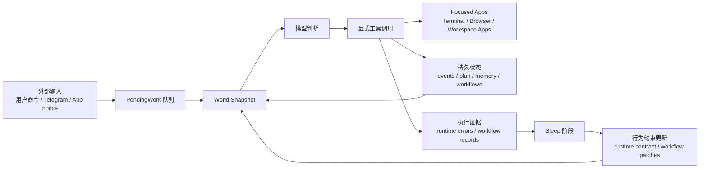
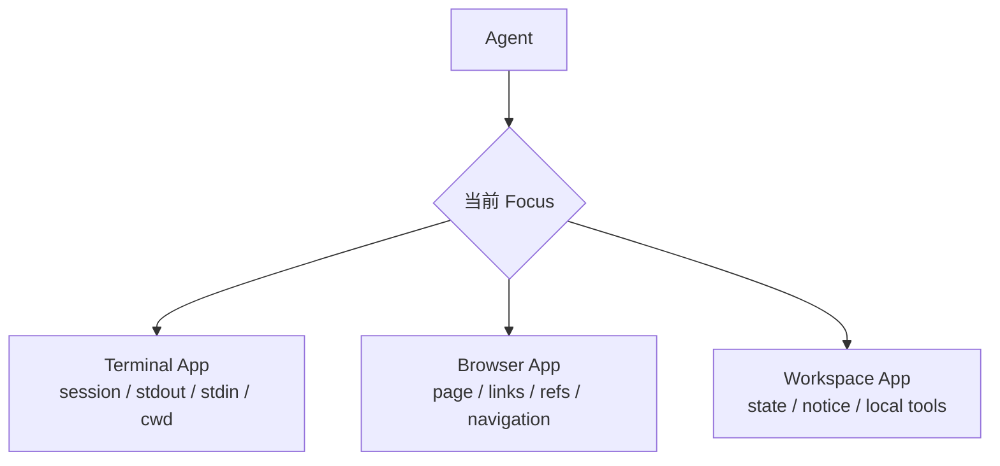
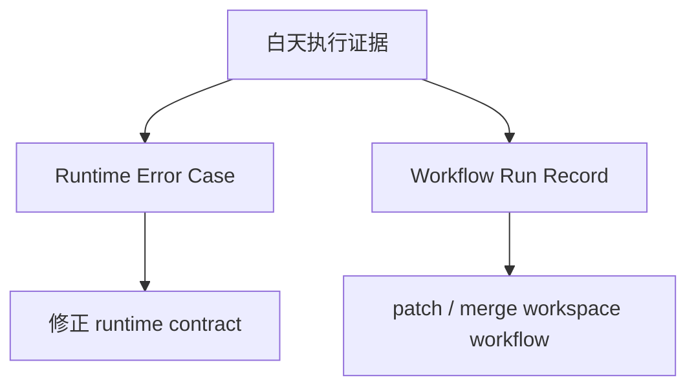


 [DaatLocus](https://github.com/shadow3aaa/DaatLocus)



DaatLocus 是一个长期运行在本地的 Agent Runtime。它试图解决的问题不是“如何再给模型塞一个工具”，而是“如何让一个 agent 真正拥有经验”。


<!--more-->


## 前言


现在 Agent 框架实在是太多了。


有的强调 tool calling，有的强调 multi-agent，有的强调 prompt，有的强调 workflow，还有的主打“它会自己反思自己”。这些当然都有用，但是我一直觉得这里面有一个很关键的问题经常被跳过去：


> Agent 到底生活在哪里？


如果它只是生活在一次对话里，那么它再会调用工具，本质上也还是一个聊天机器人。用户发一句话，它看一眼上下文，调用几个工具，最后回复一句“完成了”。这个流程当然可以解决很多任务，但是它很难积累真正的经验。


因为经验不是“我记得上次你说过什么”这么简单。


经验更像是：


- 这个项目里某类修改通常应该先检查哪些文件
- 这个用户对什么行为需要人工确认
- 这个工具在什么状态下容易失败
- 某类任务以前做错过什么，下次应该提前避免
- 哪些东西必须通过显式操作完成，不能只靠模型说一句“我已经做了”


这些东西如果只存在聊天历史里，很快就会变成一团浆糊。尤其是上下文压缩之后，灾难程度懂的都懂。


所以 DaatLocus 想做的不是再写一个“更会聊天的 agent”，而是把 LLM 放进一个长期运行、可审计、可复盘、能被人类持续塑形的 runtime 里。


这听起来有点大词堆叠。换成更简单的话就是：


> DaatLocus 的中心不是对话，而是持续运行中的世界状态。


## 问题所在


### 文本被误当成行动


很多 Agent 系统里有一个很危险的隐式假设：只要模型说“我已经完成”，系统好像就真的完成了。


但是显然不是这样。


模型说“我已经回复 Telegram 消息”，和它真的把消息发出去了，是两回事。模型说“我已经修改文件”，和文件系统真的发生了变化，也是两回事。


这听起来像废话，但在 Agent Runtime 里这非常重要。因为一旦自然语言被默认为行动，整个系统就没法审计了。你不知道外部世界到底有没有变化，也不知道失败发生在哪一层。


所以 DaatLocus 的第一条原则很简单：


> 文本不是行动，工具才改变世界。


如果要回复外部消息，就必须通过事件完成工具。如果要修改文件，就必须通过明确的文件或 patch 工具。如果要结束一个 App notice，就必须显式 resolve。


这很死板，但是必要。毕竟 runtime 不是陪模型玩角色扮演，它得知道到底发生了什么。


### 工具列表太平了


另一个问题是工具列表。


现在很多 agent 的工具设计都像这样：把所有工具平铺成一个大列表，然后让模型自己选择。


这当然简单，但是和人类实际使用电脑的方式差别很大。人不会从“所有可能操作”的全局列表里挑一个动作。我们会打开终端，看当前输出，输入命令，等待结果；或者打开浏览器，看当前页面，点击链接，再根据新页面继续操作。


也就是说，人操作的不是孤立函数，而是一个个有状态的软件表面。


如果把这个结构抹平，模型就很容易出现一种很奇怪的状态：它知道自己有很多工具，但是不知道自己“正在操作哪里”。


这就是 DaatLocus 引入 App 模型的原因。


### 记忆不是经验


长期记忆当然重要，但是我越来越觉得，单纯的 memory 对 agent 来说是不够的。


Memory 更像是“发生过什么”。而经验更像是“以后遇到类似事情应该怎么做”。


这两者差别很大。


比如用户反复告诉 agent：这个项目里修改 UI 组件之前必须先跑某个 demo。这个信息当然可以存进 memory，但是每次做任务时都指望模型从一堆历史记忆里自己抽出来，并稳定执行，显然不靠谱。


更合理的方式是把它沉淀成 workflow。也就是说，把“某类任务应该怎么做”变成一个可被 runtime 管理、可被选择、可被执行、可被改进的资产。


所以 DaatLocus 里经验不是只写进记忆，而是会进入 workflow。


### 自我改进不能是玄学


“让 agent 自我反思”这个说法很诱人，但是也很危险。


因为泛泛反思很容易把偶然现象固化成规则。模型可能今天因为一个临时问题失败了，晚上反思一下，明天给自己加了一条非常离谱的长期约束。这不是复利，这是负复利。


DaatLocus 对 self-improvement 的态度比较保守：它必须基于证据，必须知道改的是哪一层，而且应该能审计。


运行时协议错误，就修正 runtime contract。workflow 执行中反复出现的问题，就改 workflow。需要人类判断的高风险变化，就不要偷偷自动通过。


这也是为什么 DaatLocus 里有一个明确的 sleep 阶段，但它不是“模型睡觉时写小作文”。它更像是把白天的执行证据整理成可持久化行为变化的过程。


## 设计


DaatLocus 的整体循环大概是这样：





这里最关键的是，模型不是唯一事实来源。


Runtime 会维护当前世界状态，包括待处理事件、当前计划、绑定的 workflow、前台 App、App 状态、长期记忆召回结果、系统时间、机器状态等。模型每一轮看到的是整理过的 world snapshot，而不是一整坨聊天历史。


模型负责语义判断，代码负责机械工作。


比如枚举队列、查找最新事件、判断 id 是否过期、记录 workflow 执行证据、持久化状态，这些事情应该由代码做，不应该让模型凭感觉做。


不是因为模型不够强，而是因为这些事情根本不该浪费模型的注意力。


## App：面向 Agent 的软件表面


DaatLocus 里的 App 不是插件，也不是普通工具包。


App 是 agent 观察和行动时面对的、有状态的操作表面。


一个 App 至少提供三层信息：


- `state`：当前可见状态
- `usage`：什么时候应该使用它
- `how_to_use`：聚焦后应该怎样操作它


这三层必须分开。state 不是教程，usage 不是完整操作手册，how_to_use 也不是当前世界事实。


以 Terminal 为例，它之所以是 App，不是因为它能执行命令，而是因为它有持续 session、输出等待、stdin 写入、进程终止、工作目录这些时间语义。


Browser 也是同理。页面内容会变化，点击会导致跳转，元素引用可能过期，等待加载本身也是一种操作。


所以在 DaatLocus 里，Terminal 和 Browser 都不是“某个工具函数”，而是可聚焦的软件表面。





这样做的好处是局部性。


当 Terminal 被聚焦时，模型看到的是和 Terminal 相关的状态和工具。当 Browser 被聚焦时，模型看到的是页面和浏览器工具。它不需要在一个巨大的全局工具列表里随机游泳。


这也解释了一个看似反直觉的设计：Telegram 不是 App。


Telegram 在 DaatLocus 中是 transport 和 event source。新的 Telegram 消息会变成 Event，进入 pending work。模型处理这个事件时，runtime 已经知道是哪条消息、来自哪个 chat、对应哪个 event id。它不需要“打开 Telegram UI 找消息”。


如果把 Telegram 建模成 App，反而会引入隐藏游标：当前打开哪个 chat？当前选中哪条消息？发送动作是否依赖界面状态？这些都会降低可审计性。


所以 DaatLocus 里 Telegram 消息进入 Event，回复则通过显式 completion 工具进入 outbox。


## Workflow：经验的可执行载体


DaatLocus 里的 Workflow 不是 prompt。


它可以被模型读取，但它不是单纯的提示词。它是 runtime 管理的执行资产，有 id、有适用范围、有流程、有完成标准，也会留下执行记录。


一个 workflow 大概回答这些问题：


- 什么任务适合用这套流程
- 前置条件是什么
- 通常应该按什么顺序推进
- 什么算完成
- 失败或阻塞时如何恢复


这里最重要的是分层。


DaatLocus 区分三种东西：


- `WorkflowSpec`：workflow 本身，也就是可读的执行规范
- `WorkflowBinding`：当前任务是否绑定某个 workflow，这是 runtime 状态
- `WorkflowRunRecord`：白天执行后留下的证据，用于 sleep 阶段改进 workflow


这看起来有点繁琐，但非常关键。


WorkflowSpec 不应该携带“当前是否 active”这种运行时状态。WorkflowBinding 不应该写回 workflow 本身。WorkflowRunRecord 也不应该让模型手写执行日志，而是由 runtime 在任务完成边界自动记录。


否则 workflow 很快就会变成另一坨聊天历史，只是披着 markdown 的皮。


DaatLocus 还区分 builtin workflow 和 workspace workflow。


Builtin workflow 更像基础能力层，随代码仓库发布，不应该被 sleep 自动修改。Workspace workflow 才是用户长期实践中沉淀出来的本地执行经验，可以在 human-in-loop 和 sleep 机制下逐步改进。


这也是 DaatLocus 里“经验复利”的主要来源。


## Sleep：把执行证据变成长期行为


DaatLocus 的 sleep 阶段主要处理两类证据：


1. 运行时协议错误
2. workflow 执行记录


运行时协议错误指的是模型违反了全局 runtime contract 或工具协议。比如没有显式完成事件、工具参数不符合 schema、使用了过期浏览器引用、继续了错误的 terminal session 等等。


Workflow 执行记录则来自绑定 workflow 的真实任务。它说明某个 workflow 在实际执行中是否顺利，哪些步骤有效，哪里需要 patch，哪些 workflow 可能应该 merge。


因此 sleep 也分成两条路径：





这两条路径不能混。


运行时协议错误不应该直接变成某个任务 workflow 的步骤。workflow 执行质量问题也不应该随便被归因到全局 prompt。


我认为这是 agent 自我改进里非常容易被忽略的点。很多系统只要失败了，就让模型总结“以后应该注意什么”。但问题是，“以后”是哪个层级的以后？是所有任务都要遵守，还是只有某类任务？是工具协议问题，还是任务流程问题？是偶发失败，还是稳定模式？


如果这些问题不拆开，self-improvement 很容易变成一台长期污染自己上下文的机器。


听起来很吓人，但这就是现实。自动进化不加边界，大概率不是进化，是变异（）。


## Workspace App：source-first 的第三方 App


除了内置的 Terminal 和 Browser，DaatLocus 还支持 workspace app。


这里的设计方向是 source-first。第三方 App 不是一个外部黑盒插件，而是放在本地 workspace 里的源代码资产。


大致结构类似这样：






















这么做主要是为了可审计和可维护。


如果 App 是本地源代码，agent 就能在 human-in-loop 下读取、修改和维护它。它不是一个只能调用、不能理解的远程黑盒。


当然，这也带来一个约束：App 文档不能和 workflow 混在一起。


App 说明的是“这个软件表面是什么、什么时候使用、聚焦后怎么操作”。Workflow 说明的是“某类任务应该如何完成”。两者看起来都像 markdown，但语义完全不同。


这点必须分清，否则又会变成提示词大杂烩。


## Daemon 与本地长期状态


DaatLocus 默认以 daemon 模型运行。


这点也很重要。因为如果 runtime 只在命令执行期间存在，那它仍然很接近一次性工具。Daemon 让它可以持续接收外部事件，保持 App、workflow、memory、pending work 状态，并在用户不主动输入时处理后台工作。


前台界面可以 attach 到 daemon，Telegram transport、控制接口和 runtime loop 都围绕同一个长期状态工作。


安装上目前推荐使用 `cargo-binstall`：


```bash
cargo install cargo-binstall
cargo binstall daat-locus
```


第一次启动会进入交互式配置流程。


也可以直接源码运行：


```bash
git clone https://github.com/shadow3aaa/DaatLocus
cd DaatLocus
cargo run --locked
```


配置集中放在 `~/.daat-locus` 下，workspace 资产放在 `~/daat-locus-workspace` 下。这个区分也很有意义：runtime 私有状态不应该被 agent 随便当项目文件修改，而 workspace apps 和 workspace workflows 则是可编辑、可演化的资产。


## 目前的能力


目前 DaatLocus 已经有了这些核心部分：


- 长期运行 daemon 和可 attach 的 TUI dashboard
- Terminal / Browser 这类有状态 App
- Telegram transport 和事件完成模型
- provider / model 配置系统
- Hindsight 长期记忆 sidecar 托管
- workflow 绑定、执行记录和 sleep 改进路径
- workspace app 的本地源码扩展机制
- 可选的强文件系统 sandbox
- 对 OpenAI-compatible、GitHub Copilot、OpenAI Codex OAuth 等 provider 类型的支持


但是需要强调，它不是一个“装上之后全自动替你干活”的神奇软件。


我其实也不太相信那种方向。


更现实的个人 Agent 应该是：它能长期运行，能接受人的反馈，能把反馈沉淀成可执行的约束，能把失败记录下来并修正对应层级的行为。


换句话说，DaatLocus 的目标不是无约束自治，而是 human-guided self-improvement。


人类负责方向、边界和风险判断。Runtime 负责执行、验证、记录、复盘和沉淀。


## 局限


DaatLocus 现在仍然处在很早期的阶段。


尤其是 self-improvement 这件事，本身就不应该激进。workflow patch、merge、runtime contract correction 都需要足够明确的证据，否则很容易越改越怪。


Workspace App 也是一样。source-first 的设计很灵活，但是也意味着 App 的边界需要认真设计。不是所有能力都应该建模成 App，也不是所有任务流程都应该塞进 App prompt。


还有一点是安全边界。DaatLocus 是本地 agent runtime，用户拥有自己的机器。默认策略更偏向轻量自保护，而不是把它做成一个完全隔离的敌对沙箱。可选 strong sandbox 可以增强文件系统限制，但它也不是魔法安全胶带。


所以我更愿意把 DaatLocus 看成一个本地长期协作系统，而不是一个可以随便放飞的 autonomous agent。


## 总结


DaatLocus 的核心可以概括成几句话：


- 文本不是行动，工具才改变世界
- Runtime 拥有世界状态，模型只负责语义判断
- App 是有状态操作表面，不是平铺工具包
- Workflow 是可执行经验，不是聊天记忆
- Sleep 消费执行证据，不是泛泛反思
- Human-in-loop 不是阻碍自治，而是经验复利的来源


我认为未来真正有用的个人 Agent，大概率不会只是一个更长上下文的聊天窗口。


它应该更像一个长期运行在本地的 runtime：知道当前世界状态，知道哪些任务正在等待，知道自己正在操作哪个软件表面，知道哪些流程来自过去经验，也知道哪些事情必须等人类确认。


这就是 DaatLocus 想做的东西。


一个真正拥有经验的 agent runtime。
