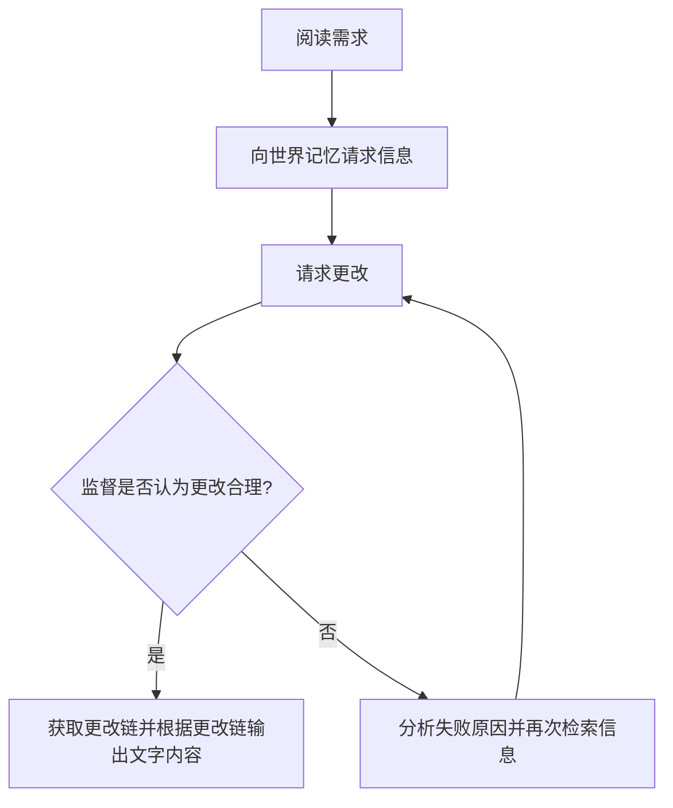


  与Blog同步开发的开源项目: [PlotWeave](https://github.com/shadow3aaa/PlotWeave)


## 前言

使用 LLM 来写小说是一个很有趣的，而且很“符合设计”的事情。我是说，既然它是 “Large Language Model”，我们当然应该用它做一些语言相关的事。

<!--more-->

## 设计

截止到 2025/9/25，一般认为主流的 SOTA LLM 的文笔已经不是问题。

### 问题所在

问题在于记忆。

下面用中文网文小说《诡秘之主》举例（豪堪），它全篇总计 446.52 万字，通常认为 1 个中文字符 ≈ 0.6 个 token。  
那么就是：

`446.52 × 0.6 ≈ 267 万 token`

目前对 LLM 的一次对话窗口来说，这是一个很大的量。下面列出了几个模型的上下文长度

- GPT-4: 8,192 tokens，即约 0.82 万
- GPT-4 (32k): 32,768 tokens，即约 3.28 万
- GPT-5 系列: 128,000 tokens，即约 12.8 万
- Gemini-2.5 (flash/pro): 1,000,000 tokens，即约 100 万

可以看到，连 Gemini-2.5 这个断档领先的模型上下文长度都不能达到小说的要求。

甚至，我们还需要考虑以下两点

- 输入/思考/其它内容所占的 token
- 由于[Lost In The Middle](https://arxiv.org/abs/2307.03172)现象，实际上不可能利用完整的上下文达到预期记忆效果

这就导致尝试简单的使得模型记住整个小说的上下文，并据此实现不出现逻辑错误，符合剧情设计完全不可能。我们必须要提出一种工程方法解决记忆上的问题。

在 coding agent 领域我们早就有了很多相关的实践。其中最经典和常用的是设置某个阈值，当当前上下文超过阈值时就触发"压缩"。"压缩"的意思是独立一次请求让模型精简并总结整个上下文内容，然后清空对话历史，将这个总结作为新的初始上下文输入。

如果经常使用这种模式的 coding agent，很容易就会发现这个总结的效果实在是一言难尽，无论是参数相对小的模型，还是公认 coding 能力很好的大参数模型。你总是会发现等待了几分钟完成压缩之后，又得重新人工引导让模型了解它真正需要的上下文，否则就会造成灾难性的结果。

对于工程化组织代码文件，为了可维护性做出诸多优化，有人监督的场景尚且如此，套在小说场景只会更加恐怖。

如果我要说小说从来就没有系统化的工程方法，似乎有点过于冒进。但我还是认为严格来说，小说从来没有像软件工程那样被系统化过。虽然有大纲、人物设定、世界观设定，但它们从未发展成统一的、被广泛认可的“工程方法论”。这本身就说明了文字内容的管理难度。很显然，不可能将同样的压缩逻辑应用在小说 llm 上。

为此，我提出一种关系图为核心的"世界记忆"模型，它需要满足以下设计需求

- 只能做出合理的修改行为
- 形式化表示实体和实体的关系

要做到第一点，有三种实现方式

1. 尝试使用机械化的规则自动验证，就目前的计算机能力看来这显然不太可能
2. 人工监督验证
3. 让另一个 agent 验证

2 我认为更显示，3 更加自动化。在我看来这两者没有很大的高低之分，也许使用 2 可以创作出更有人类"灵魂"的小说，毕竟是人决定了人物究竟可以做出什么，而 3 显而易见在自动生产方面非常的方便。我们并不需要二选一，它们本质上都是监督过程，完全可以抽象出来，两个都要。

使用此记忆模型，llm 创作时的循环如下

