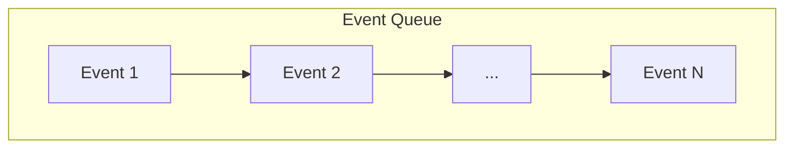
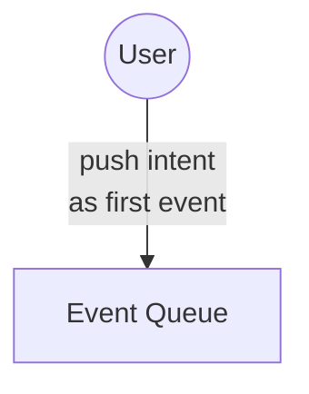
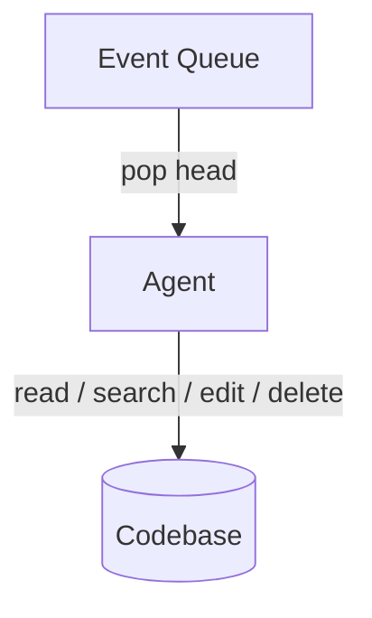
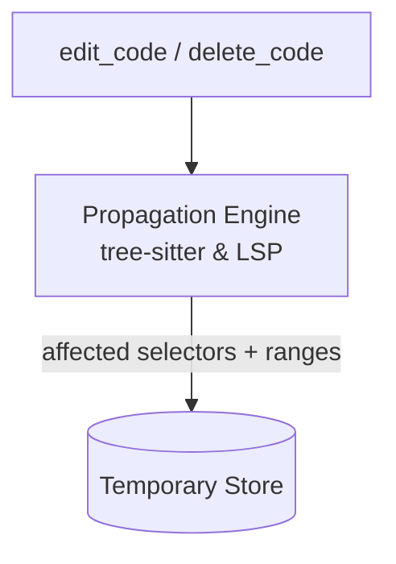
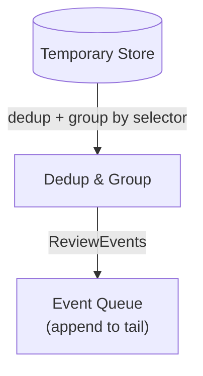
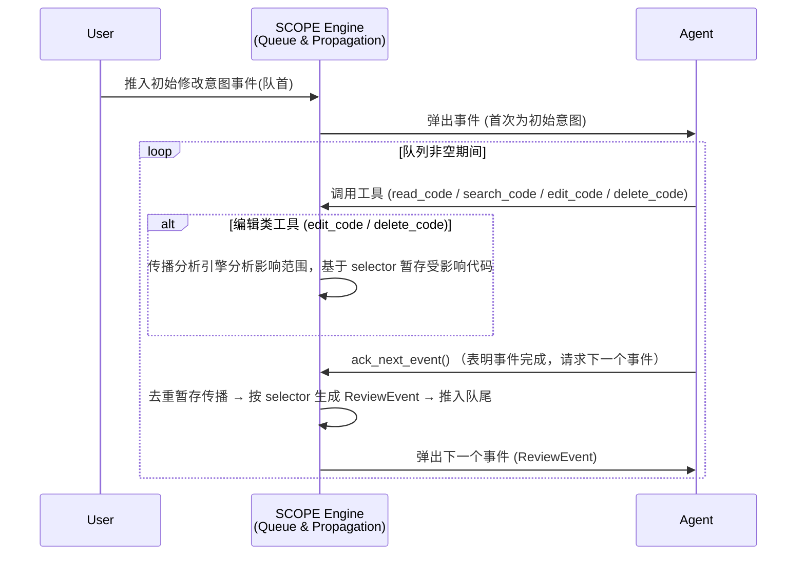

在vibe coding越来越流行的今天，很多拥抱coding agent的项目都面临着同样的问题：明明引入了外部智能体来代理完成项目，却反而导致项目越改越乱。

一开始只是些预兆：明明没改过的功能突然报错；修复完一个 bug 又出现两个；agent修改忘了考虑1-2处细节。后面却变得越来越严重：修复漏洞的速度从一开始的马上发现，变得需要各种调试手段才能勉强完成；实现新feat引发的bug越来越多...

<!--more-->

这不是模型不够聪明。也不是人类描述得不够细。而是 **vibe coding 在人和最终运行的代码之间，楔入了一个全新的间隙，即语言模型本身**。这个间隙带来了两种以前从未被正视过的不对齐。

为此，本文提出SCOPE (Semantic Code Operation & Propagation Engine)来缓解此问题。

## **错误的根源：两层不对齐**

我认为，vibe coding目前有两层不对齐问题，它们共同导致了工程走向劣化。

这两层可以概括为人和代码的不对齐。在传统工程中，代码直接由人的思维逻辑借程序语法产生。因此，bug只可能来自于思维逻辑的漏洞和对语法不了解所导致的错误使用。而在vibe coding中，代码并不直接由人产生，这就导致了人的思维模型和代码实际逻辑产生了新的空隙(即中间用于生成代码的agent)。这空隙最终反映到软件上就产生了bug。

也就是说，vibe coding引入的问题只来自于两类: **人和agent的不对齐**，**agent和代码的不对齐**。

**人和agent的不对齐**来自于过度模糊的意图和反馈的缺乏。比如，“帮我编写一个聊天软件”，这里即使agent完整的产出了软件代码，也会产生巨大的空隙。因为agent无从得知具体应该使用怎么样的技术栈，通信模型等等信息，它只能根据自己的内部参数组合出一套逻辑模型，而人基本没有动力去了解和同步这一大长串代码，这又导致了无法通过反馈来同步逻辑模型。

或者，如果模型能力过弱，直接无法理解人类的逻辑模型，也会导致这种情况，不过这不是工程上可以解决的问题，这里不讨论。

**agent和代码的不对齐**来自于编写工作流本身。假设我们有一个采用预扣模式的速率限制器，配合业务错误时需要回滚的协议（这类设计在细粒度资源控制中很常见）：

```rust
// rate_limiter.rs
pub struct RateLimiter {
    tokens: i32,
    max_tokens: i32,
}

impl RateLimiter {
    /// 预扣一个令牌，若成功则返回 true，否则返回 false
    pub fn check_limit(&mut self) -> bool {
        if self.tokens > 0 {
            self.tokens -= 1;
            true
        } else {
            false
        }
    }

    /// 回滚一个令牌（当请求未实际消耗资源时调用）
    pub fn rollback_limit(&mut self) {
        if self.tokens < self.max_tokens {
            self.tokens += 1;
        }
    }
}
```

```rust
// api_handler.rs
use crate::rate_limiter::RateLimiter;

pub fn handle_request(limiter: &mut RateLimiter, user_id: u64) -> Result<Response, Error> {
    // 业务前置检查
    if !user_exists(user_id) {
        return Err(Error::UserNotFound);
    }
    
    // 核心处理
    let data = fetch_data(user_id)?;
    Ok(Response::new(data))
}
```

现在，人类提出：“在 API 处理入口加入速率限制，若令牌不足则直接返回 429。”

Agent 通过语义搜索定位到了 `handle_request` 函数。它迅速理解了人类的要求，并在局部做出了看似极其完美的修改：

```diff
--- a/src/api_handler.rs
+++ b/src/api_handler.rs
@@ -1,6 +1,11 @@
 pub fn handle_request(limiter: &mut RateLimiter, user_id: u64) -> Result<Response, Error> {
+    // Agent 添加的速率限制检查
+    if !limiter.check_limit() {
+        return Err(Error::RateLimited);
+    }
+
     // 业务前置检查
     if !user_exists(user_id) {
         return Err(Error::UserNotFound);
     }
```

这段代码编译完全通过，且非常符合人类直觉（入口处先检查限流，失败就拒绝）。在针对“令牌不足”的局部测试中，它也完全符合人类的要求。

但实际上，Agent 埋下了一颗静默崩溃的炸弹：由于 Agent 缺乏对跨模块协议的全局理解，它完全没有意识到 `RateLimiter` 采用“预扣”设计——`check_limit` 已经将令牌数减 1。当后续业务逻辑因 `UserNotFound`、`fetch_data` 失败等原因返回错误时，已经扣减的令牌永远不会被回滚。外部调用方只是拿到了一个业务错误，根本不知道需要调用 `rollback_limit`。

结果就是：每一次业务错误都会导致令牌永久丢失。随着时间推移，令牌池被虚假的失败请求耗尽，合法请求全部被拒绝，整个系统陷入“伪死锁”，再也无法正常服务。

## SCOPE: 消除空隙的引擎

SCOPE的核心是一个事件队列。



首先，将用户的修改意图作为第一个事件推入队列首部。



然后开始循环从队列首部弹出并处理事件。第一个事件让agent根据初始的修改意图搜索并修改代码库。



为此，SCOPE提供五个工具:

- read_code(selector)
- edit_code(selector, patch_v4a)
- delete_code(selector)：独立工具，单独传播规则。
- search_code(query)
- ack_next_event()

每当编辑工具被调用时，SCOPE内部的传播分析引擎（基于tree sitter & lsp）就会分析出影响的代码范围，并基于修改的selector暂存它们。



agent完成事件后，将会调用`ack_next_event` 表明此事件完成，请求下个事件。此时之前暂存的修改传播经过去重处理后，会以selector为id整合为多个ReviewEvent进入队尾。



因此agent得到的下个事件就会是审查某个修改的影响范围，如果它发现问题并进行修改，就会产生新的ReviewEvent。反复这个过程直到清空队列。

下面是整个流程的时序图：


